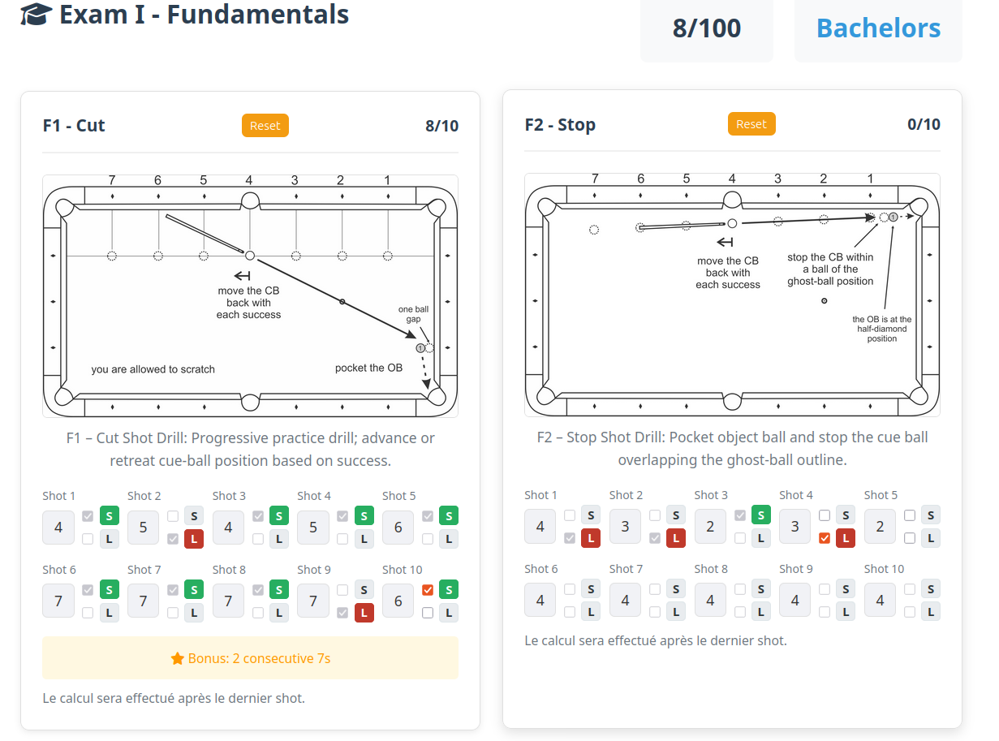
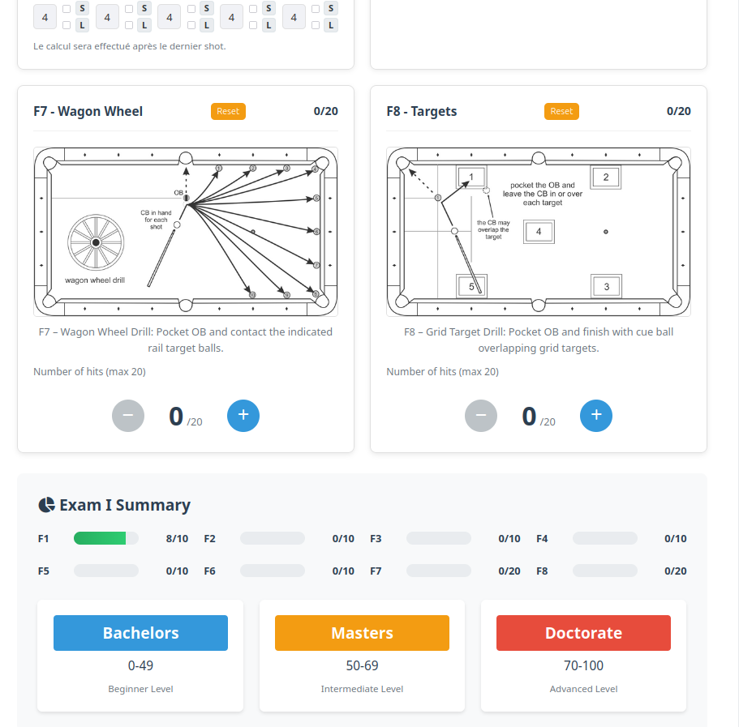

# 🎱 Billiard University Scoring System
### https://billiarduniversity.org/testing/exams/






A Vue.js application for scoring and tracking Billiard University exams.

## Quick Start

1. Install dependencies:
```bash
npm install
```

2. Run development server:
```bash
npm run dev
```

3. Open http://localhost:3000

## Features
- Complete Exam I & II scoring
- Real-time calculations
- Score history tracking
- Export functionality
- Responsive design

## Project Structure
```
billiard-university-app/
├── src/
│   ├── components/     # Vue components
│   ├── store/         # State management
│   ├── utils/         # Utilities
│   └── assets/        # Styles
├── public/            # Static files
└── index.html         # Entry point
```

## License
MIT

## 🙏 Acknowledgments

- Built with assistance from **DeepSeek AI Assistant**
- Built with assistance from **Copilot AI Assistant**
- Based on the original Billiard University scoring system
- Icons by [Font Awesome](https://fontawesome.com)
- Built with [Vue.js](https://vuejs.org)

---

### 🤖 AI Assistance
This project was developed with the assistance of **DeepSeek AI and Copilot Assistant**, which helped with:
- Vue.js 3 application architecture
- Scoring logic implementation
- Component design and structure
- Deployment configuration for GitHub Pages

*Note: While AI assistance was used in development, all code decisions and implementations were reviewed and adapted for this specific use case.*
